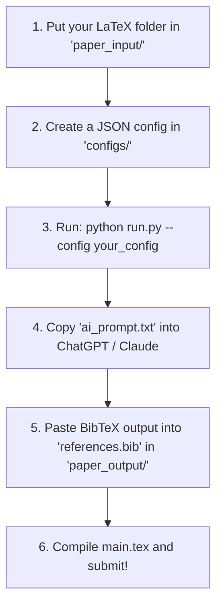

# Getting Started Guide — Turnitout

Welcome to Turnitout! This guide walks you through processing a brand-new paper from scratch.

---

## 🚀 How it Works (The 30-Second Overview)



---

## 📖 Step-by-Step Guide: Processing a New Paper from Scratch

Follow these steps if you are running the software for a brand-new paper:

### Step 1: Copy your LaTeX Project Folder
Copy your entire LaTeX project folder (containing your `.tex` files, `.bib` bibliography file, and image folders) and paste it inside the **`paper_input/`** directory.

*For example, if your paper folder is called `MyPhysicsPaper`, your path should look like:*
`paper_input/MyPhysicsPaper/main.tex`

---

### Step 2: Create a Configuration File
The tool needs to know where your files are and what topics your paper covers so it can suggest relevant citations.

1. Go to the **`configs/`** folder.
2. Create a new file named after your project with a `.json` extension (e.g., **`my_physics_paper.json`**).
3. Copy, paste, and customize the following template inside that JSON file:

```json
{
  "project_name": "my_physics_paper",
  "input_dir": "paper_input/MyPhysicsPaper",
  "tex_file": "paper_input/MyPhysicsPaper/main.tex",
  "bib_file": "paper_input/MyPhysicsPaper/references.bib",
  "output_dir": "paper_output/MyPhysicsPaper-modified",
  "synonym_aggressiveness": 0.55,
  "random_seed": 42,
  "min_sentence_length_for_cite": 60,
  "topic_citations": [
    {
      "keywords": ["quantum mechanics", "schrodinger", "wavefunction", "state"],
      "key": "ref_quantum_basics",
      "topic": "Foundations of Quantum Mechanics and Wave Mechanics"
    },
    {
      "keywords": ["gravity", "relativity", "einstein", "space-time"],
      "key": "ref_general_relativity",
      "topic": "Einstein's General Relativity and Gravitational Theory"
    }
  ]
}
```

#### 💡 What is `topic_citations`? (How citation mapping works):
This is where you tell the tool how to match citations. 
* **`keywords`**: The script scans your text sentences. If it finds any of these words (e.g. "wavefunction") in a sentence that doesn't have a citation, it will automatically append `\cite{ref_quantum_basics}` to the end of that sentence.
* **`key`**: The unique key added to your text (`\cite{ref_quantum_basics}`).
* **`topic`**: A description of the scientific topic. The tool does not search the internet; instead, it outputs this topic in a text prompt so you can ask an AI (like ChatGPT) to fetch the real paper details.

---

### Step-by-Step Continued...

### Step 3: Run the Script
Open your command prompt or terminal in the project root directory, and run the program pointing to your configuration file (omit the `.json` extension):

```bash
python run.py --config my_physics_paper
```

*(Note: If you run `python run.py` without the `--config` flag, it defaults to the built-in `math_thesis` configuration).*

---

### Step 4: Resolve the Citations with AI
When the run finishes:
1. Open your generated output folder: **`paper_output/MyPhysicsPaper-modified/`**.
2. Locate and open the file **`ai_prompt.txt`** (which Python generated for you).
3. **Copy the entire text** inside this file and paste it into ChatGPT, Claude, or Gemini.
4. The AI will immediately return real, highly-cited papers formatted as BibTeX entries matching your keys (e.g., `@article{ref_quantum_basics, ...}`).
5. Copy the AI's BibTeX output and paste it at the bottom of the **`references.bib`** file located inside your output directory (`paper_output/MyPhysicsPaper-modified/references.bib`).

---

### Step 5: Build and Compile
1. Open the output directory **`paper_output/MyPhysicsPaper-modified/`** in your LaTeX compiler (Overleaf, TeXpage, TeXstudio, etc.).
2. Compile **`main.tex`**. All citations will render correctly and link to real scientific papers. Your document is ready for Turnitin!
