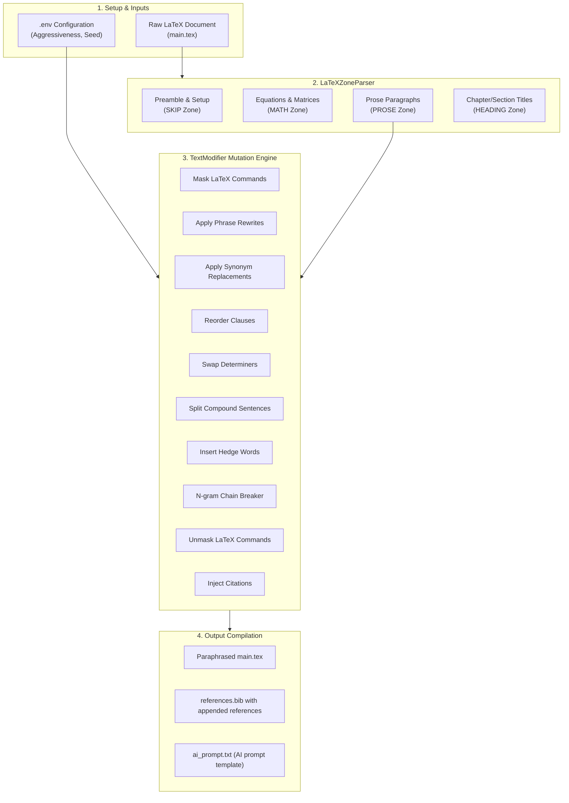
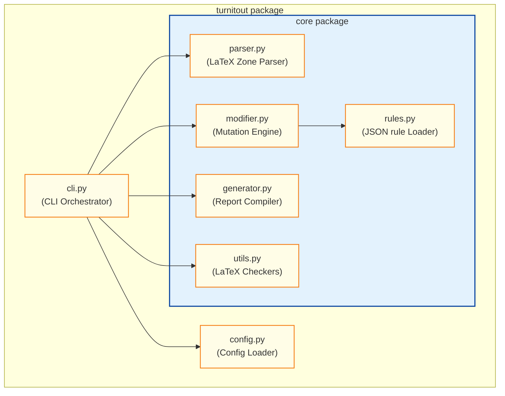
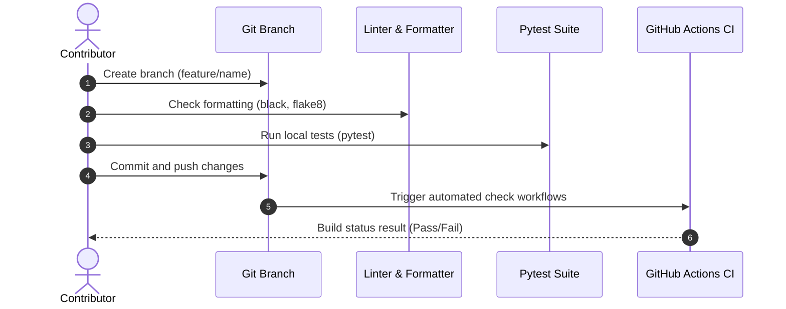

<p align="center">
  
</p>

<h1 align="center">Turnitout</h1>

<p align="center">
  <strong>Intelligent LaTeX Plagiarism & Similarity Reduction Tool</strong>
</p>

<p align="center">
  <a href="https://github.com/AhmadHassan-BTed/Turnitout/actions"></a>
  <a href="LICENSE"></a>
  <a href="https://www.python.org/"></a>
  <a href="https://semver.org/"></a>
</p>

<p align="center">
  Created and maintained by <a href="https://github.com/AhmadHassan-BTed"><strong>Ahmad Hassan (B-Ted)</strong></a>.
</p>

---

## 💡 Preserving the Academic Voice

Writing is a deeply personal, human craft. Yet under the rigid constraints of similarity scanners like Turnitin, authors are often forced to rewrite their natural voice or break their formatting simply to bypass automated string matching. 

Turnitout resolves this friction. By automating the process of breaking matching n-gram chains while leaving mathematical equations and structures untouched, Turnitout protects formatting integrity, allowing researchers to focus on real scientific discovery.

---

## ⚡ Getting Started (3-Minute Setup)

Turnitout runs out-of-the-box with zero configuration required. Follow these simple steps:

### 1. Install Python
* Download and install Python from [python.org/downloads](https://www.python.org/downloads/).
* **Windows Users**: Ensure the box **"Add Python to PATH"** is checked during setup.

### 2. Prepare the Input Folder
1. Locate the **`paper_input/`** folder in this directory.
2. Copy your LaTeX paper folder into it (containing your `main.tex`, `references.bib`, and asset folders).

### 3. Run the Process
1. Open a terminal or command prompt in this directory.
   - *Windows Shortcut*: Open this folder in File Explorer, type `cmd` in the address bar, and press Enter.
2. Execute the following command:
   ```bash
   python run.py
   ```
3. The pipeline will automatically scan your folder, run keyword analysis, and perform similarity reduction.

### 4. Finalize Citations with AI
1. Open the generated folder inside **`paper_output/`**.
2. Open the file **`ai_prompt.txt`**, copy the entire text, and paste it into ChatGPT, Claude, or Gemini.
3. Paste the AI's BibTeX response at the bottom of the **`references.bib`** file in your output folder.
4. Upload your output folder to Overleaf or compile it locally. The document is compile-ready.

---

<details>
<summary><b>🛠️ Advanced Customization & Parameter Tables (Click to Expand)</b></summary>

### Configuration Parameters
Overrides are controlled via environment variables inside a `.env` file placed at the project root:

| Variable | Description | Type | Default |
| --- | --- | --- | --- |
| `TURNITOUT_AGGRESSIVENESS` | Probability rate of swapping words with synonyms | Float (`0.0`-`1.0`) | `0.75` |
| `TURNITOUT_MIN_SENTENCE_LEN` | Minimum char length of a sentence to inject citations | Integer | `45` |
| `TURNITOUT_RANDOM_SEED` | Seed value ensuring output reproducibility | Integer | `42` |

### Configuration File Example
Copy `.env.example` to `.env` to configure your overrides:
```bash
# Synonym aggressiveness (float value between 0.0 and 1.0)
TURNITOUT_AGGRESSIVENESS=0.75

# Minimum sentence length for citation insertion (integer)
TURNITOUT_MIN_SENTENCE_LEN=45

# Random seed (integer)
TURNITOUT_RANDOM_SEED=42
```
</details>

<details>
<summary><b>📂 Project File Directory Structure (Click to Expand)</b></summary>

```text
Turnitout/
├── .github/                  # Community configurations and workflows
│   ├── CODE_OF_CONDUCT.md    # Contributor Covenant Code of Conduct
│   ├── CONTRIBUTING.md       # Onboarding guide
│   ├── SECURITY.md           # Security disclosure instructions
│   └── SUPPORT.md            # Community support directions
├── configs/                  # Paper-specific configurations
├── docs/                     # Release documentation, roadmaps, and guides
│   ├── architecture.md       # LaTeX parser zone structures
│   ├── changelog.md          # Semantic version history log
│   ├── getting-started.md    # Detailed onboarding user guide
│   └── roadmap.md            # Project milestone planning
├── paper_input/              # Raw document input folder
├── paper_output/             # Paraphrased clean document output folder
├── rules/                    # Editable rules database JSON files
├── src/                      # Packaged source directory
│   └── turnitout/
│       ├── __init__.py
│       ├── cli.py            # CLI Runner orchestrator
│       ├── config.py         # Config loader & environment parser
│       └── core/
│           ├── parser.py     # Structural LaTeX tokenizer
│           ├── modifier.py   # Mutation pipeline engine
│           ├── generator.py  # References & report compiler
│           ├── rules.py      # Rule file JSON loader
│           └── utils.py      # LaTeX syntax validation checkers
├── tests/                    # Automated testing suite
├── .editorconfig             # Standardized indent styles
├── .env.example              # Environment variable overrides template
├── .gitattributes            # Line normalization rules (eol=lf)
├── .gitignore                # Target directories exclusion definitions
├── LICENSE                   # MIT License
├── README.md                 # Project documentation (this file)
├── pyproject.toml            # Python package setup & test configurations
└── run.py                    # Root launcher wrapper calling CLI module
```
</details>

## 🏗️ Under the Hood: System Architecture & Workflow

### 1. Processing Pipeline
The document undergoes structural zoning before modification to ensure mathematical equations, formatting macros, and citations remain intact:



### 2. Internal Module Coupling
The codebase is structured to enforce high functional cohesion and clear interface boundaries:



---

## 🧪 Testing & Contributor Workflows

### Local Testing
Tests are designed to verify syntax-safety and programmatic API contracts:
```bash
# Install development dependencies
pip install -e .[dev]

# Run unit tests
python -m pytest

# Check code formatting & linting
black --check src/ tests/
flake8 src/ tests/
```

### Contribution Integration
New modifications are validated automatically via CI checks:



---

## 🛡️ Release, Support & Security

- **Release Changes**: History logs are available in [docs/changelog.md](docs/changelog.md).
- **Milestone Planning**: Upcoming changes are outlined in [docs/roadmap.md](docs/roadmap.md).
- **Support Directions**: Guidelines are available in [SUPPORT.md](.github/SUPPORT.md).
- **Security Reporting**: Vulnerabilities should be reported according to [SECURITY.md](.github/SECURITY.md).
