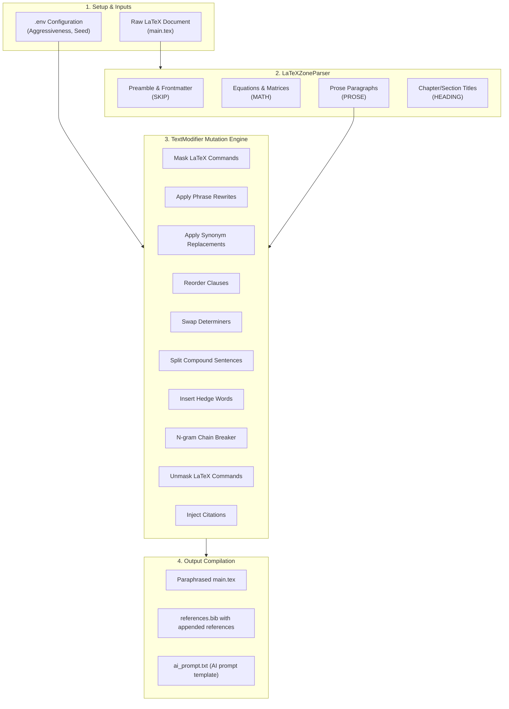
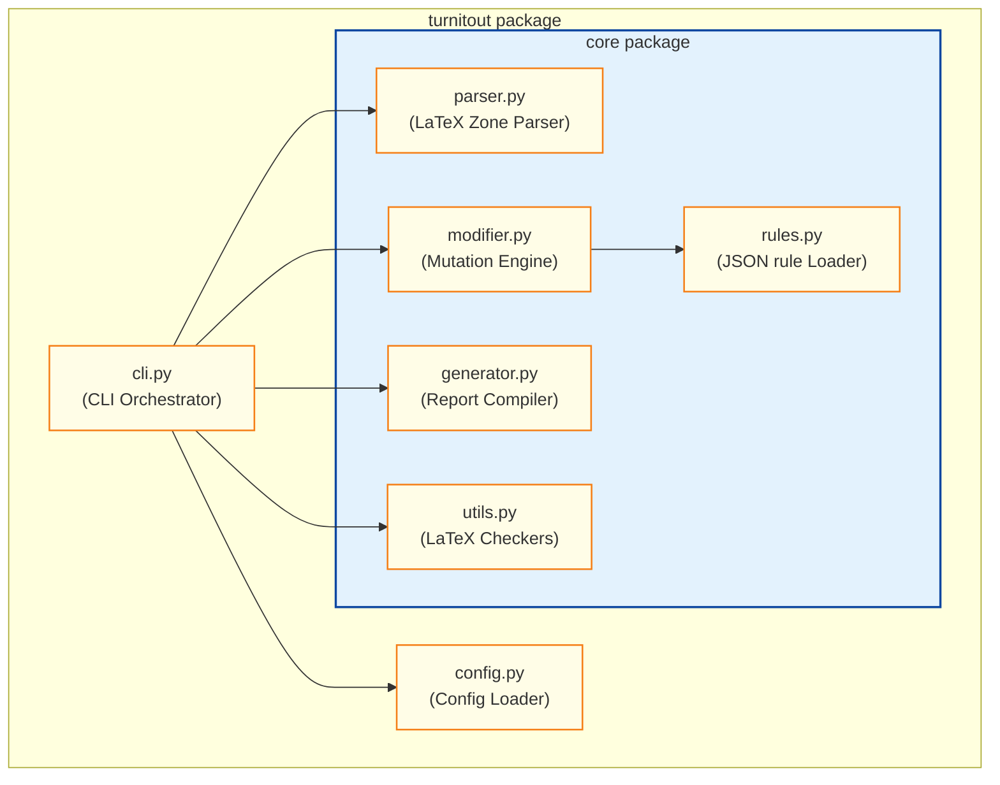
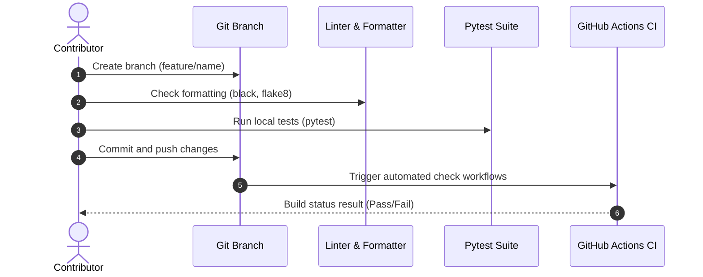

<p align="center">
  
</p>

<h1 align="center">Turnitout</h1>

<p align="center">
  <strong>Intelligent LaTeX Plagiarism & Similarity Reduction Tool</strong>
</p>

<p align="center">
  <a href="https://github.com/AhmadHassan-BTed/Turnitout/actions"></a>
  <a href="LICENSE"></a>
  <a href="https://www.python.org/"></a>
  <a href="https://semver.org/"></a>
</p>

<p align="center">
  Created and maintained by <a href="https://github.com/AhmadHassan-BTed"><strong>Ahmad Hassan (B-Ted)</strong></a>.
</p>

---

## 💡 The Human Side of Turnitout

Writing is a deeply personal, human craft. Yet, under the rigid constraints of automated similarity scanners like Turnitin, researchers, students, and authors are often forced to rewrite their natural voice, break their equations, or spend days manually replacing phrases simply to bypass automated string matching. 

Turnitout was created to solve this friction. By automating the mechanical process of breaking up matching n-gram chains while leaving mathematical formulations, structure, and academic formatting untouched, Turnitout protects the author's formatting integrity, allowing researchers to spend their energy on real scientific discovery.

---

## 🎓 Layman Quick Start (Start Here if You Do Not Code)

This tool can be run easily by anyone, even with zero programming experience. Follow these simple steps:

### 1. Prerequisites (Python)
- Ensure **Python** is installed. (Download and install it from [python.org](https://www.python.org/downloads/)).
- **IMPORTANT (Windows)**: During the installation process, check the box that says **"Add Python to PATH"** before clicking install.

### 2. Prepare the Input Folder
1. Locate the **`paper_input/`** folder in this directory.
2. Copy your LaTeX paper folder into it (e.g. copy a folder named `MyPaper` containing `main.tex`, `references.bib`, and any image assets).

### 3. Run the Tool
1. Open a terminal or command prompt in this directory.
   - *Windows shortcut*: Open this folder in File Explorer, click the address bar, type `cmd`, and press Enter.
2. Execute the following command:
   ```bash
   python run.py
   ```
3. The tool will auto-detect your files, perform keyword analysis on-the-fly, and complete the similarity reduction.

### 4. Finalize Citations with AI
1. Go to the **`paper_output/`** directory and open the generated folder.
2. Open the file **`ai_prompt.txt`** (which has been generated for you).
3. **Copy the entire text** and paste it directly into ChatGPT, Claude, or Gemini.
4. Copy the AI's BibTeX response and paste it at the bottom of the **`references.bib`** file in your output folder.
5. Upload the contents of your output folder to Overleaf or compile it locally. The document is compile-ready.

---

## 🧭 System Workflow & Pipeline

The pipeline runs sequentially to parse, isolate, rewrite, and cite LaTeX documents:



---

## 🏗️ Repository Architecture & Dependency Coupling

The codebase is organized as an installable Python package designed with high cohesion and low coupling:



---

## 🗂️ Project File Structure

Detailed configuration and dynamic rule databases are mapped out below:

* **`configs/`**: Project-specific parameters (paths, citation mappings).
* **`rules/`**: Human-editable translation and synonym dictionaries.
  * `rules/synonyms.json`: Academic word replacements.
  * `rules/phrases.json`: Sequential n-gram rewrite rules.
  * `rules/protected_terms.json`: Protected mathematical and technical words.
  * `rules/conjunctions.json`: Conjunction list used for clause reordering.
  * `rules/determiners.json`: Swap lists for determiners.
  * `rules/hedge_words.json`: List of academic hedges.
* **`src/turnitout/`**: Core package source folder.
* **`tests/`**: Unit test suites testing syntax-safety and api contracts.

---

## ⚙️ Configuration & Environment Settings

System overrides are controlled via environment variables inside a `.env` file placed at the project root:

| Variable | Description | Type | Default |
| --- | --- | --- | --- |
| `TURNITOUT_AGGRESSIVENESS` | Probability rate of swapping words with synonyms | Float (`0.0`-`1.0`) | `0.75` |
| `TURNITOUT_MIN_SENTENCE_LEN` | Minimum char length of a sentence to inject citations | Integer | `45` |
| `TURNITOUT_RANDOM_SEED` | Seed value ensuring output reproducibility | Integer | `42` |

<details>
<summary><b>🔍 View Example `.env` File</b></summary>

```bash
# Synonym aggressiveness (float value between 0.0 and 1.0)
TURNITOUT_AGGRESSIVENESS=0.75

# Minimum sentence length for citation insertion (integer)
TURNITOUT_MIN_SENTENCE_LEN=45

# Random seed (integer)
TURNITOUT_RANDOM_SEED=42
```
</details>

---

## 📦 Installation & Setup

1. **Clone the Repository**:
   ```bash
   git clone https://github.com/AhmadHassan-BTed/Turnitout.git
   cd Turnitout
   ```

2. **Configure Virtual Environment**:
   ```bash
   python -m venv env
   # On Windows:
   env\Scripts\activate
   # On macOS/Linux:
   source env/bin/activate
   ```

3. **Install Package**:
   Install the package locally in editable development mode:
   ```bash
   pip install -e .[dev]
   ```

---

## 📖 Basic Usage

### Option 1: Zero-Configuration Auto-Detection (Default)
Place your raw LaTeX project folder inside `paper_input/` (e.g. `paper_input/MyBiologyPaper/` containing `main.tex`, `references.bib`, and asset images). 

Then, run:
```bash
python run.py
```
*The tool automatically scans `paper_input/`, configures files on-the-fly, extracts the top 10 scientific keywords from your paper, paraphrases prose, and outputs the result in `paper_output/MyBiologyPaper-modified/`.*

### Option 2: Configured Run with Overrides
If you want to explicitly define citation keywords or adjust paths, configure a JSON file in `configs/my_paper.json` and execute with the `--config` flag:
```bash
python run.py --config my_paper
```

---

## 🧪 Testing & Quality Control

Verify code and formatting syntax rules pass before committing:

```bash
# Run unit tests
python -m pytest

# Check code formatting rules
black --check src/ tests/

# Perform lint analysis
flake8 src/ tests/
```

---

## 🛠️ Developer & CI Workflow

The workflow for integrating new features or updating dictionaries follows these steps:



Detailed contribution workflows are documented in [CONTRIBUTING.md](.github/CONTRIBUTING.md).

---

## 🛡️ Support & Support Channels

Questions or requests can be directed to the following channels:
* **Support Directions**: Guidelines are available in [SUPPORT.md](.github/SUPPORT.md).
* **Security Reporting**: Vulnerabilities should be reported according to [SECURITY.md](.github/SECURITY.md).
* **Release Changes**: History logs are available in [docs/changelog.md](docs/changelog.md).
* **Milestone Planning**: Upcoming changes are outlined in [docs/roadmap.md](docs/roadmap.md).
