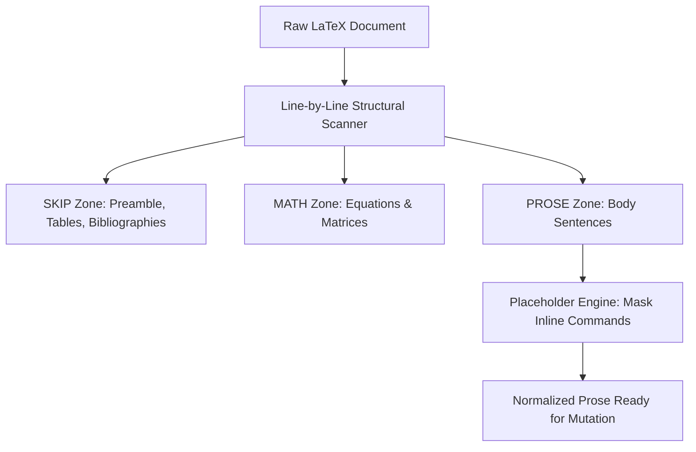
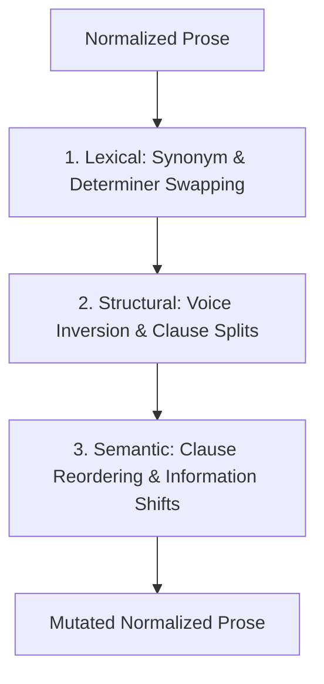
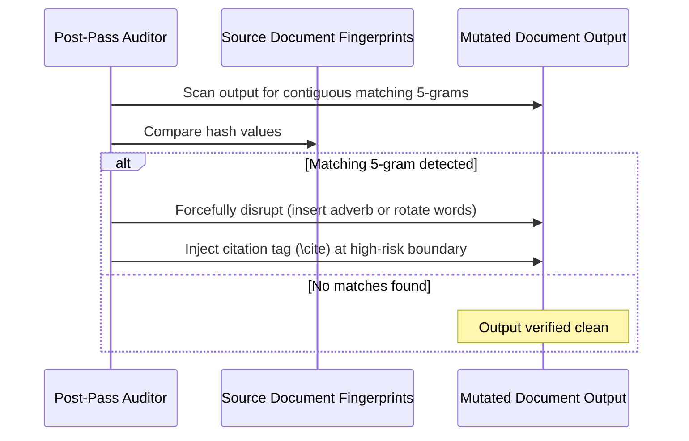

<p align="center">
  
</p>

<h1 align="center">Turnitout</h1>

<p align="center">
  
  
  <a href="https://turnitout.streamlit.app/"></a>
</p>

<p align="center">
  <strong>An intelligent LaTeX plagiarism and similarity reduction engine designed to preserve the academic voice and document formatting.</strong>
  
  *The core linguistic mutation rules, placeholder encoders, and file parsing structures of Turnitout are closed-source. This repository serves as the public documentation landing page and release reference hub.*
</p>

<hr />

## The Philosophy

Academic writing is a personal, human craft. Yet under the rigid rules of automated similarity checkers like Turnitin, researchers are often forced to rewrite their natural voice, break sentence flow, or compromise document layouts simply to clear string-matching thresholds.

Turnitout resolves this constraint. By automating the disruption of contiguous word sequences while leaving mathematical expressions, matrices, figures, and citation indexes completely untouched, Turnitout protects the formatting of academic work, allowing researchers to write naturally and submit safely.

---

## Technical Architecture

Turnitout runs a multi-pass text processing and transformation pipeline. It isolates LaTeX macros and formatting codes before applying linguistic mutations to prose segments.

### 1. Structural LaTeX Zoning & Masking

The engine reads the source document and divides it into strict structural zones. Non-prose elements (such as equations, preambles, and code blocks) are placed into bypass zones. Prose elements are passed through a character-level placeholder engine that masks remaining inline LaTeX commands.



### 2. Multi-Pass Mutation Engine

Once commands are masked, the system executes sequential linguistic modifications. The engine processes text through lexical, structural, and semantic stages to alter both vocabulary and sentence topology:



### 3. Source-Aware N-gram Audit & Citation Shielding

In the final phase, the engine unmasks the formatting placeholders and performs a post-pass verification. It cross-references the mutated document directly against the source text. 



---

## Key Features

* **Zero-Formatting Disruption**: Structural parsers guarantee that Overleaf projects compile with zero formatting bugs.
* **Morphological Synonym Alignment**: Inflection stemmers conjugate synonyms to match pluralization, tense, and adverbial form.
* **Linguistic Burstiness Control**: Alternates sentence fusions and splits to randomize sentence length and perplexity.
* **Granular Intensity Adjustments**: Exponential sliders offer precise control over word replacement rates and transformation fire rates.

---

## Directory Structure (Private Repository)

*The following outlines the internal directory layout of the closed-source Turnitout engine:*

```
Turnitout/
├── configs/                  # Paper-specific configurations
├── docs/                     # Documentation and user manuals
├── paper_input/              # Raw LaTeX project folders
├── paper_output/             # Modified output document folders
├── rules/                    # Structured rule dictionary catalogs
│   ├── academic/             # Formal rules and parentheticals
│   └── conversational/       # Casual rules and markers
├── src/                      # Core runtime packages
│   └── turnitout/
│       ├── cli.py            # CLI pipeline entry point
│       ├── config.py         # Config and environment loader
│       ├── ui_launcher.py    # Desktop Tkinter GUI controller
│       └── core/
│           ├── parser.py     # Structural LaTeX tokenizer
│           ├── modifier.py   # Text mutation engine
│           ├── rules.py      # Rules manager and JSON importer
│           └── generator.py  # Report and templates builder
├── tests/                    # Vitest and Pytest runner suites
├── LICENSE                   # Proprietary License
├── pyproject.toml            # Build tool configurations
└── streamlit_app.py          # Hosted web application interface
```

---

## AI-Driven Rules Expansion

Turnitout separates linguistic data from execution code. Developers and AI agents can expand dictionary files directly under the `rules/` directory. Each JSON file contains an embedded `__prompt__` tag, allowing AI systems to securely add data without affecting the codebase logic:

* **[synonyms.json](rules/academic/synonyms.json)**: Academic terms and context-mapped alternatives.
* **[phrases.json](rules/academic/phrases.json)**: Complex word replacements and academic idioms.
* **[transition_phrases.json](rules/academic/transition_phrases.json)**: Logical connectors to vary paragraph rhythm.
* **[qualifiers.json](rules/academic/qualifiers.json)**: Safe adverbs inserted to break contiguous word strings.

---

## Access and Hosting

The production interface of Turnitout is hosted and managed as a web application:

**[Deploy and Access Turnitout](https://turnitout.streamlit.app/)**

---

## Roadmap

* **Q3 2026**: Interactive visual diff parser showing exact word-level alterations.
* **Q4 2026**: Pre-compile validation tests to catch broken syntax before output generation.
* **Q1 2027**: Expanded synonym mappings for specialized scientific disciplines.

---

## License

The code and linguistic engine of Turnitout are Proprietary and closed-source. The documentation and display guidelines in this repository are available under the project's Proprietary License.
