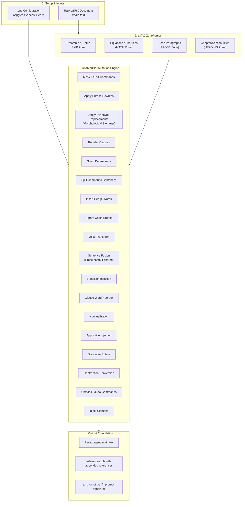
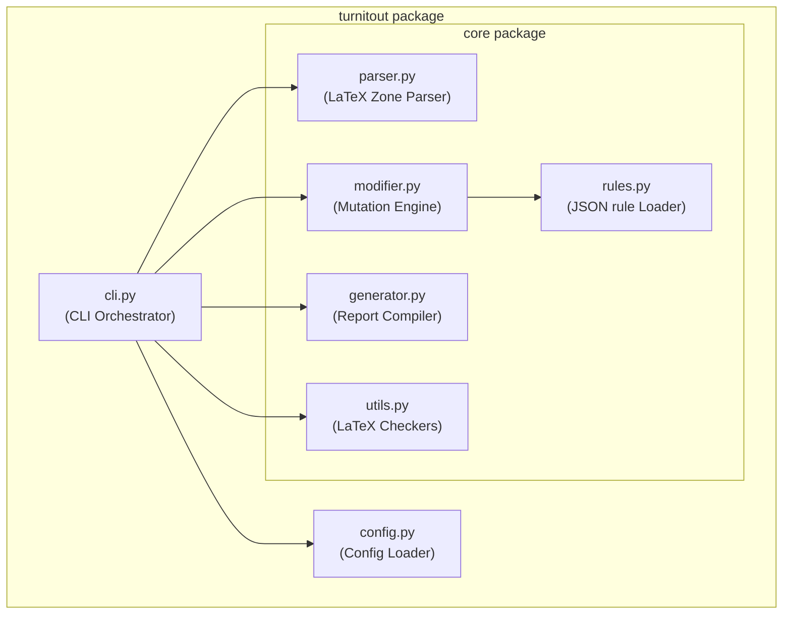
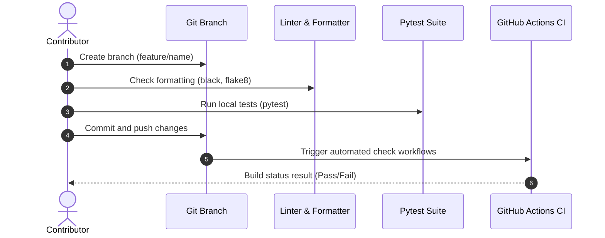

<p align="center">
  
</p>

<h1 align="center">Turnitout</h1>

<p align="center">
  <strong>Intelligent LaTeX Plagiarism & Similarity Reduction Tool</strong>
</p>

<p align="center">
  <a href="https://github.com/AhmadHassan-BTed/Turnitout/actions"></a>
  <a href="LICENSE"></a>
  <a href="https://www.python.org/"></a>
  <a href="https://semver.org/"></a>
</p>

---

## 💡 Preserving the Academic Voice

Writing is a deeply personal, human craft. Yet under the rigid constraints of similarity scanners like Turnitin, authors are often forced to rewrite their natural voice or break their formatting simply to bypass automated string matching.

Turnitout resolves this friction. By automating the process of breaking matching n-gram chains while leaving mathematical equations and structures untouched, Turnitout protects formatting integrity, allowing researchers to focus on real scientific discovery.

---

## ⚡ Getting Started (3-Minute Setup)

Turnitout runs out-of-the-box with automatic Python verification and setup. Follow these simple steps:

### 1. Prepare the Input Folder

1. Locate the **`paper_input/`** folder in this directory.
2. Copy your LaTeX paper folder into it (containing your `main.tex`, `references.bib`, and asset folders).

### 2. Run the Tool

- **Windows Users**: Double-click **`run.bat`** (or run `run.bat` from a command prompt).
- **macOS & Linux Users**: Open a terminal in this directory and run:
    ```bash
    chmod +x run.sh
    ./run.sh
    ```
    _The runners automatically verify Python, trigger an auto-installation if Python is missing, set up dependency packages, and execute the pipeline._

### 3. Finalize Citations with AI

1. Open the generated folder inside **`paper_output/`**.
2. Open the file **`ai_prompt.txt`**, copy the entire text, and paste it into ChatGPT, Claude, or Gemini.
3. Paste the AI's BibTeX response at the bottom of the **`references.bib`** file in your output folder.
4. Upload your output folder to Overleaf or compile it locally. The document is compile-ready.

---

## 🛠️ Advanced Customizations & Configuration

Overrides can be configured via environment variables inside a `.env` file placed at the project root:

| Variable                     | Description                                           | Type                | Default |
| ---------------------------- | ----------------------------------------------------- | ------------------- | ------- |
| `TURNITOUT_AGGRESSIVENESS`   | Probability rate of swapping words with synonyms      | Float (`0.0`-`1.0`) | `0.75`  |
| `TURNITOUT_MIN_SENTENCE_LEN` | Minimum char length of a sentence to inject citations | Integer             | `45`    |
| `TURNITOUT_RANDOM_SEED`      | Seed value ensuring output reproducibility            | Integer             | `42`    |
| `TURNITOUT_VOICE_TRANSFORM`  | Enable active <-> passive voice transformations        | Boolean             | `true`  |
| `TURNITOUT_VOICE_RATE`       | Voice transformation activation rate                  | Float (`0.0`-`1.0`) | `0.30`  |
| `TURNITOUT_SENTENCE_FUSION`  | Enable fusing short adjacent sentences                 | Boolean             | `true`  |
| `TURNITOUT_FUSION_RATE`      | Sentence fusion activation rate                       | Float (`0.0`-`1.0`) | `0.25`  |
| `TURNITOUT_TRANSITION_INJECT`| Enable inserting academic transitions                 | Boolean             | `true`  |
| `TURNITOUT_TRANSITION_RATE`  | Transition injection activation rate                  | Float (`0.0`-`1.0`) | `0.25`  |
| `TURNITOUT_WORD_REORDER`     | Enable rearranging prepositional phrases              | Boolean             | `true`  |
| `TURNITOUT_REORDER_RATE`     | Clause word reordering activation rate                | Float (`0.0`-`1.0`) | `0.20`  |
| `TURNITOUT_NOMINALIZATION`   | Enable rotating nominalizations                       | Boolean             | `true`  |
| `TURNITOUT_NOMINAL_RATE`     | Nominalization activation rate                        | Float (`0.0`-`1.0`) | `0.20`  |
| `TURNITOUT_APPOSITIVE`       | Enable explaining nouns with appositives              | Boolean             | `true`  |
| `TURNITOUT_APPOSITIVE_RATE`  | Appositive injection activation rate                  | Float (`0.0`-`1.0`) | `0.35`  |
| `TURNITOUT_DISCOURSE_ROTATE` | Enable rotating sentence-starting discourse markers   | Boolean             | `true`  |
| `TURNITOUT_DISCOURSE_RATE`   | Discourse marker rotation activation rate             | Float (`0.0`-`1.0`) | `0.50`  |

To override settings, copy `.env.example` to `.env` and set the desired values:

```bash
# Example .env configuration
TURNITOUT_AGGRESSIVENESS=0.75
TURNITOUT_MIN_SENTENCE_LEN=45
TURNITOUT_RANDOM_SEED=42
```

---

## 📂 Project Directory Structure

The repository is structured to separate execution files, rules, configs, and documentation:

```text
Turnitout/
├── .github/                  # Community configurations and workflows
│   ├── CODE_OF_CONDUCT.md    # Contributor Covenant Code of Conduct
│   ├── CONTRIBUTING.md       # Onboarding guide
│   ├── SECURITY.md           # Security disclosure instructions
│   └── SUPPORT.md            # Community support directions
├── configs/                  # Paper-specific configurations
├── docs/                     # Release documentation, roadmaps, and guides
│   ├── architecture.md       # LaTeX parser zone structures
│   ├── changelog.md          # Semantic version history log
│   ├── getting-started.md    # Detailed onboarding user guide
│   └── roadmap.md            # Project milestone planning
├── paper_input/              # Raw document input folder
├── paper_output/             # Paraphrased clean document output folder
├── rules/                    # Editable rules database JSON files
├── src/                      # Packaged source directory
│   └── turnitout/
│       ├── __init__.py
│       ├── cli.py            # CLI Runner orchestrator
│       ├── config.py         # Config loader & environment parser
│       └── core/
│           ├── parser.py     # Structural LaTeX tokenizer
│           ├── modifier.py   # Mutation pipeline engine
│           ├── generator.py  # References & report compiler
│           ├── rules.py      # Rule file JSON loader
│           └── utils.py      # LaTeX syntax validation checkers
├── tests/                    # Automated testing suite
├── .editorconfig             # Standardized indent styles
├── .env.example              # Environment variable overrides template
├── .gitattributes            # Line normalization rules (eol=lf)
├── .gitignore                # Target directories exclusion definitions
├── LICENSE                   # MIT License
├── README.md                 # Project documentation (this file)
├── pyproject.toml            # Python package setup & test configurations
│── run.py                    # Root launcher wrapper calling CLI module
└── run.bat                   # Windows batch script launcher
```

---

## 🏗️ Under the Hood: System Architecture & Workflow

### 1. Processing Pipeline

The document undergoes structural zoning before modification to ensure mathematical equations, formatting macros, and citations remain intact:



### 2. Internal Module Coupling

The codebase is structured to enforce high functional cohesion and clear interface boundaries:



---

## 🧪 Testing & Contributor Workflows

### Local Testing

Tests are designed to verify syntax-safety and programmatic API contracts:

```bash
# Install development dependencies
pip install -e .[dev]

# Run unit tests
python -m pytest

# Check code formatting & linting
black --check src/ tests/
flake8 src/ tests/
```

### Contribution Integration

New modifications are validated automatically via CI checks:



---

## 🛡️ Release, Support & Security

- **Release Changes**: History logs are available in [docs/changelog.md](docs/changelog.md).
- **Milestone Planning**: Upcoming changes are outlined in [docs/roadmap.md](docs/roadmap.md).
- **Support Directions**: Guidelines are available in [SUPPORT.md](.github/SUPPORT.md).
- **Security Reporting**: Vulnerabilities should be reported according to [SECURITY.md](.github/SECURITY.md).

---

<p align="center">
  Created and maintained by <a href="https://github.com/AhmadHassan-BTed"><strong>Ahmad Hassan (B-Ted)</strong></a> 🤓⌨️
</p>
