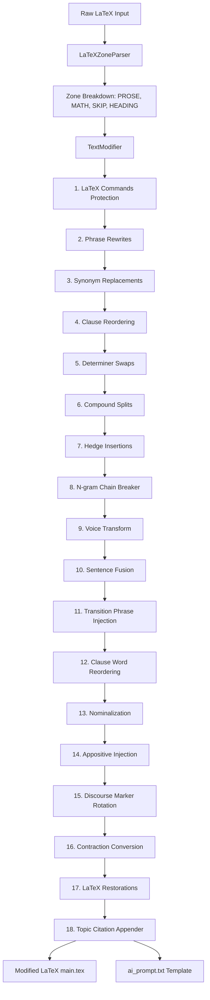

# System Architecture — Turnitout

Turnitout utilizes a deterministic, modular pipeline to reduce plagiarism and similarity indices in LaTeX documents. It prioritizes semantic preservation and syntax security.

---

## High-Level System Workflow

---

## Core Components

### 1. Configuration & Environments (`turnitout.config`)
- Loads settings from `configs/*.json` or performs folder auto-detection inside `paper_input/`.
- Merges configurations with `.env` settings (for parameters like random seed or aggressiveness threshold), enforcing standard priority rules.
- Contains the 7 new advanced styling toggles and fire rate parameters.

### 2. LaTeX Parser (`turnitout.core.parser`)
- Scans files line-by-line to isolate prose from LaTeX syntax.
- Places lines into strict zone categories:
  - `PROSE`: Modifiable text body lines.
  - `HEADING`: Header rows (subject to light edits like phrase rewrites; never synonym replaced).
  - `MATH`: Display/inline equations (completely untouchable).
  - `SKIP`: Preamble, figures, bibliography, code listings, and tables (completely untouchable).

### 3. Text Modifier (`turnitout.core.modifier`)
- Operates on a character-level placeholder engine to temporarily mask all remaining LaTeX commands (e.g. `\textbf`, `\cite`) inside prose lines.
- Sequentially executes 15 pipeline stages:
  1. **Masking**: Replaces LaTeX syntax with temporary indicators (`\x00PH0000\x00`).
  2. **Phrase Rewrites**: Replaces long, flagged academic idioms with concise alternatives. Implements placeholder protection to prevent formatting corruption.
  3. **Synonym Replacements**: Iterates over tokens and rolls for synonym swaps against the custom JSON dictionary. Uses a Morphological Inflection Stemmer to automatically stem and conjugate synonyms.
  4. **Clause Reordering**: Switches subordinate clause positions.
  5. **Determiner Swaps**: Switches determiners contextually.
  6. **Compound Splits**: Breaks long compound sentences into smaller sentences.
  7. **Hedge Insertions**: Inserts academic qualifiers (like "notably", "essentially") near clause breaks.
  8. **N-gram Chain Breaker**: Scans lines for remaining consecutive word chains of length 5+ and inserts parentheticals.
  9. **Voice Transform**: Rotates passive and active voice structures to break stylometric uniformity.
  10. **Sentence Fusion**: Combines short adjacent prose sentences (using prose-only context filtering) to increase sentence complexity and burstiness.
  11. **Transition Injection**: Automatically inserts transitions at sentence boundaries to disrupt predictable patterns.
  12. **Clause Word Reordering**: Rearranges prepositional elements within clauses to change positions of k-gram sequences.
  13. **Nominalization**: Rotates noun and verb variants to decrease stylistic predictability.
  14. **Appositive Injection**: Explains academic nouns using explanatory appositive phrases.
  15. **Discourse Marker Rotation**: Alternatives discourse connectors at sentence starts.
  16. **Contraction Conversion**: Swaps formal word groups to contractions and vice versa.
  17. **Restoration**: Recursively unmasks the placeholder indicators.
  18. **Citations**: Automatically appends `\cite{...}` if keywords match a configured citation topic.
