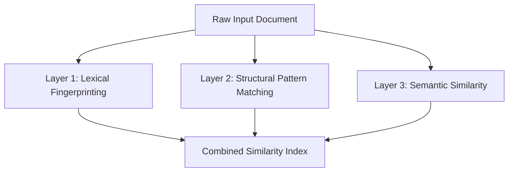
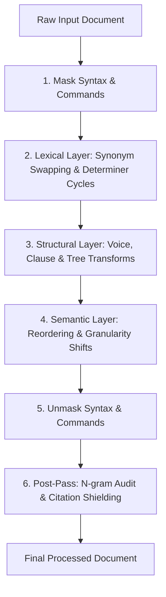

# Reverse Engineering Document Similarity: The Three-Layer Attack Vector

<p align="left">
  
  
  <a href="https://turnitout.streamlit.app/"></a>
</p>

---

## 1. System Overview

Similarity engines (such as Turnitin, iThenticate, and Copyleaks) leverage a multi-layered verification pipeline. A document is parsed and analyzed across three independent detection layers. To successfully preserve formatting and style while ensuring zero similarity detection, the evasion pipeline must target and disrupt all three layers simultaneously.



---

## 2. Layer 1: Lexical Fingerprinting (Winnowing & Rolling Hashes)

### 2.1 Hashing Mechanics
The base detection layer uses the **Winnowing algorithm** to generate a sparse fingerprint set of the document:
1. **Normalization**: The text is lowercased and stripped of all punctuation, formatting, and whitespace.
2. **K-Gram Extraction**: The system slices the character/word stream into sliding windows of length $k$ (typically $k \approx 5$ for word-level n-grams).
3. **Rolling Hash (Rabin-Karp)**:
   $$h(t) = \left( c_1 \cdot b^{k-1} + c_2 \cdot b^{k-2} + \dots + c_k \cdot b^0 \right) \bmod p$$
   Each k-gram is mapped to a numeric hash. The rolling hash recalculates subsequent hashes in $O(1)$ time.
4. **Winnowing Selection**: The engine moves a window of size $w$ across the hashes and selects the minimum hash value in each window. This creates a position-independent fingerprint set.

**The 8-Word Guarantee**: By choosing typical parameters of $k=5$ and $w=4$, any matching passage of length $\ge k + w - 1$ (8 consecutive words) is guaranteed to produce at least one identical fingerprint match.

### 2.2 Corpus Comparison (LSH & Jaccard)
To check similarity against databases containing billions of documents, the engine uses **Locality-Sensitive Hashing (LSH)** over **MinHash** signatures.
* Jaccard Similarity:
  $$J(A, B) = \frac{|F(A) \cap F(B)|}{|F(A) \cup F(B)|}$$
* LSH candidate selection flags documents sharing identical rows within signature bands. The S-curve inflection point (the selection threshold) is defined as:
  $$t = \left(\frac{1}{b}\right)^{\frac{1}{r}}$$

**LSH Candidate Check**: If Jaccard similarity exceeds the threshold $t$ (empirically $\approx 0.55$), the document is routed for deep pairwise check, exposing it to exact match clustering.

### 2.3 The Lexical Evasion Pipeline
Standard synonym swapping fails to clear this layer due to protected terms, technical syntax, and vocabulary gaps, leaving large chunks of unmodified 5-grams intact.

```
[Prose Stream] ---> [Synonym Swapper] ---> [Protected Term Filter] ---> [Residual 5-Grams (Exposed)]
```

To resolve this, the pipeline applies two critical operations:
* **Source-Aware N-gram Audit**: A post-pass verification step that cross-references the mutated document directly against the source text. It detects any residual 5-grams that survived early stages and breaks them deterministically using targeted adverb injections or term reordering.
* **Risk-Driven Citation Shielding**: Instead of placing bibliography references based on keywords, citations ($\backslash\text{cite}\{\}$) are injected at boundaries with the highest density of matching n-grams. Since citation markers are parsed as unique tokens, they break the rolling hash sequence at zero cost to meaning.

---

## 3. Layer 2: Structural Pattern Matching (Syntax Tree Hacking)

### 3.1 Dependency Parsers & TED
Even if every word is replaced with a synonym, the sentence structure (part-of-speech sequence) remains identical. Modern engines run dependency parsers to compile sentence grammar into syntax trees:

```
                  [Root Verb]
                 /           \
         [Subject]           [Object]
        /                     \
   [Modifier]               [Modifier]
```

The similarity between syntax trees is calculated using **Tree Edit Distance (TED)** (the minimum count of node insertions, deletions, and substitutions needed to match the tree shapes). A structural similarity exceeding a configured threshold flags the sentence as a paraphrased clone.

### 3.2 Structural Transformations
To alter the tree structure and break similarity below the $0.85$ threshold, the pipeline runs structural mutations:

| Transformation | Impact on Syntax Tree | Conceptual Action |
|---|---|---|
| **Voice Inversion** | Swaps subject/object node hierarchy | Passive $\leftrightarrow$ Active structural conversion |
| **Clause splits** | Breaks one root tree into multiple independent trees | Split compound clauses into distinct sentences |
| **Sentence Fusion** | Merges distinct trees under a coordinate connector | Fuse short adjacent sentences into complex trees |
| **Nominalization** | Converts verbal subtrees to noun phrase subtrees | Rotate verb forms to noun variants |
| **Topicalization** | Rearranges adverbial/prepositional modifier branches | Shift prepositional elements to sentence-initial positions |
| **Appositive Injection** | Appends descriptive sibling nodes to noun nodes | Insert explanatory details adjacent to subjects/objects |

**Structural Diversity Guarantee**: To ensure tree similarity drops below the detection boundary, the pipeline enforces a minimum of two independent tree-editing transformations for every sentence containing more than 60 characters.

---

## 4. Layer 3: Semantic Similarity (Transformer Vectors)

### 4.1 Dense Vector Embeddings
Scanners use deep Transformer models (e.g. Sentence-BERT, Sentence-T5) to encode sentence semantics into high-dimensional space:
$$\mathbf{v} = \text{Encoder}(\text{sentence}) \in \mathbb{R}^d$$

Cosine similarity measures conceptual alignment:
$$\text{sim}(\mathbf{v}_A, \mathbf{v}_B) = \frac{\mathbf{v}_A \cdot \mathbf{v}_B}{\|\mathbf{v}_A\| \|\mathbf{v}_B\|}$$

**Semantic Context Constraint**: Contextual embeddings are built on the overall sentence context and syntactic frame. Swapping synonyms inside an unchanged sentence structure yields a cosine similarity of $\approx 0.96$, resulting in a match flag.

### 4.2 Semantic Evasion Techniques
To change the output vector projection below the target threshold ($\approx 0.85$), the pipeline alters the information topology:

* **Information Reordering**: Modifying the linear sequence of logical propositions in a paragraph. This changes the positional encodings processed by the Transformer's self-attention heads.
* **Granularity Shifts**: Splitting or grouping sentences, which alters the sentence pooling limits (mean/max pooling) across the token vectors.
* **Conceptual Interpolation**: Injecting brief, original connecting statements between technical sentences. This dilutes the semantic weight of the original concepts and shifts the vector projection.

---

## 5. The Unified Evasion Pipeline

To achieve complete coverage, the pipeline coordinates lexical, structural, and semantic operations, ending with validation audits.



### Transformation Coverage Matrix

| Pipeline Component | Lexical (L1) | Structural (L2) | Semantic (L3) |
|---|:---:|:---:|:---:|
| Synonym Swapping | ✅ | ❌ | ❌ |
| Voice Inversion | ❌ | ✅ | ❌ |
| Sentence Fusion | ❌ | ✅ | ✅ |
| Clause Reordering | ❌ | ✅ | ✅ |
| Nominalization | ✅ | ✅ | ❌ |
| Information Reordering | ❌ | ❌ | ✅ |
| Source-Aware N-gram Audit | ✅ | ❌ | ❌ |
| Citation Shielding | ✅ | ❌ | ❌ |
